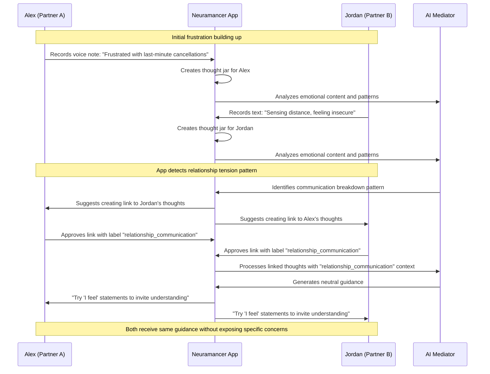
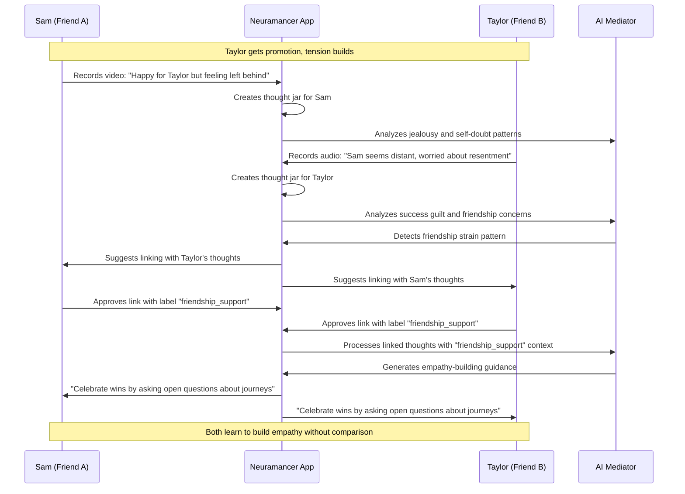
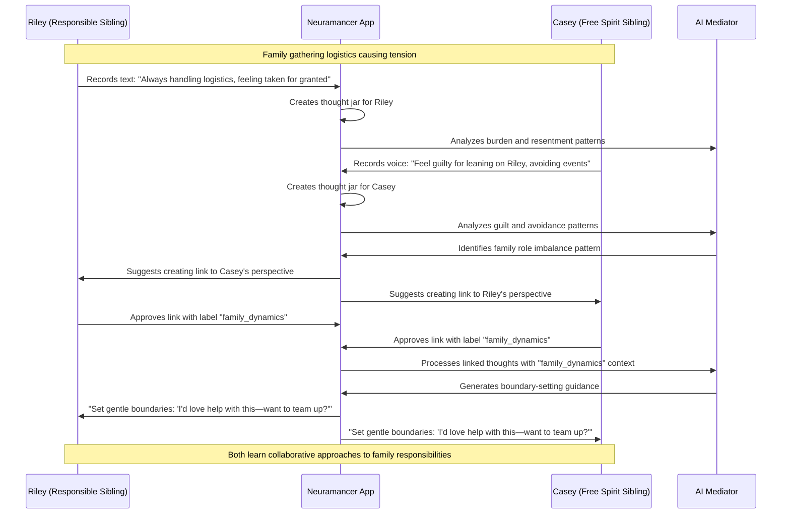
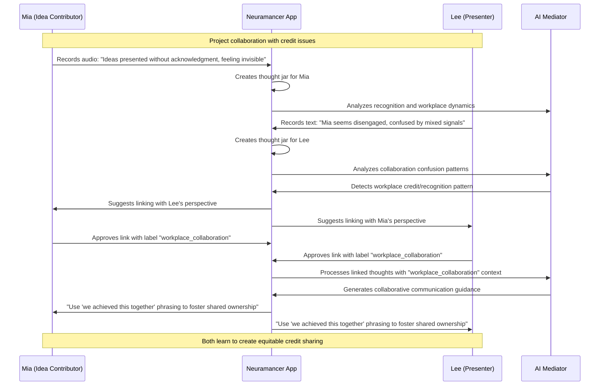
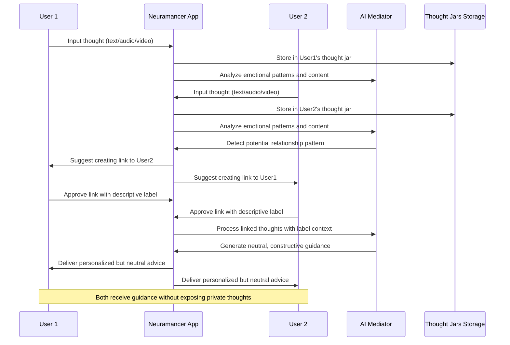

# Neuramancer App - Sequence Diagrams

This document contains sequence diagrams illustrating how the Neuramancer app acts as a neutral mediator in various interpersonal scenarios.

## Scenario 1: Romantic Partners Holding Back Resentments

## Scenario 2: Close Friends Navigating Jealousy

## Scenario 3: Siblings Dealing with Family Role Expectations

## Scenario 4: Coworkers Grappling with Unspoken Credit Disputes

## General App Flow Pattern

## Key Features Illustrated

1. **Privacy Preservation**: Individual thoughts remain private in separate "thought jars"
2. **Mutual Consent**: Both parties must approve links before information sharing
3. **Contextual Labels**: Labels like "relationship_communication" guide how the AI processes linked information
4. **Neutral Mediation**: AI provides guidance without revealing specific private thoughts
5. **Pattern Recognition**: AI identifies relationship dynamics and communication patterns
6. **Constructive Guidance**: Focus on building better communication skills rather than blame
